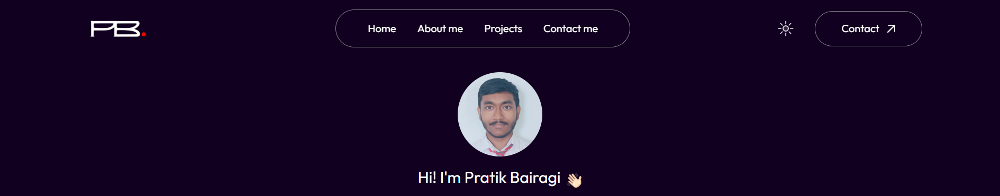

  

<h1 align="center" style="font-family: Arial, sans-serif; color: #FF6F61; text-shadow: 2px 2px 4px rgba(0,0,0,0.5);">
  Portfolio 
</h1>

  
  
  
  
  
  
  
  
  

  
  

A simple and easy Next.js personal portfolio website hosted and managed using Varcel for CI/CD functionalities.

## Features🔧

- User-friendly interface
- Dark/Light modes
- Responsive 
- Web3foems integration for personalized mails

## Screenshots🖼️

  
  

## Contributing🤝

Contributions are always welcome!

## Authors🧍

- [linkedin](www.linkedin.com/in/pratik-bairagi)
- [Website](https://my-portfolio-rouge-iota-67.vercel.app/)

